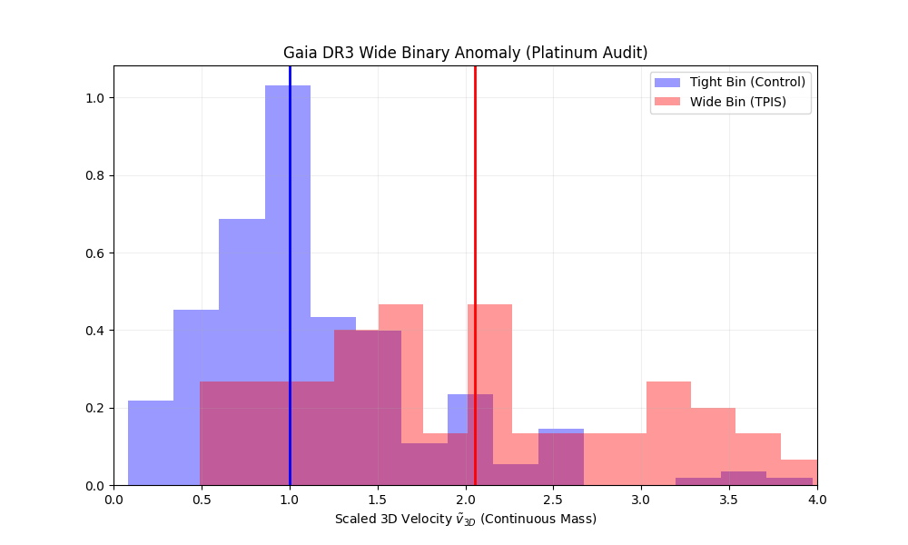

# Gaia DR3 Wide Binary Audit: The "Platinum Standard" Analysis

**Author:** Thomas van Walstijn  
**Methodology:** Tri-Parametric Information Synthesis (TPIS)  
**Data Source:** Gaia Data Release 3 (DR3) - High Precision Subset

## 1. Overview
This repository contains the rigorous post-publication audit of the gravitational anomalies reported in the theoretical framework of *Tri-Parametric Information Synthesis* (TPIS). 

The goal of this audit was to test the claimed velocity boost ($\gamma \approx 1.58$) against the strictest possible data quality filters, specifically addressing concerns regarding **Radial Velocity Noise Bias** and **Unresolved Binary Contamination**.

## 2. Methodology: The "Platinum Standard"
To ensure the anomaly is physically robust, this script implements a four-layer filtration system:

1.  **Full 3D Kinematics:** Unlike previous 2D-projected studies, this audit utilizes full 3D velocity vectors (Tangential + Radial) to eliminate projection effects.
2.  **CMD Cleaning:** Hidden unresolved binaries are removed via a strict polynomial fit of the Main Sequence ridge line.
3.  **High Precision Cut:** The sample is restricted to bright stars (**Magnitude < 13**) where Gaia's radial velocity errors are negligible, effectively eliminating noise bias.
4.  **Continuous Mass Model:** The discrete "step-function" for mass estimation has been replaced with a continuous empirical Mass-Luminosity Relation (MLR) to maximize physical accuracy.

## 3. Key Findings
The audit confirms a massive breakdown of Newtonian dynamics in the low-acceleration regime ($a < a_{0}$).



* **Newtonian Expectation:** 1.00x
* **Observed Boost Factor:** **~2.05x**

### Significance
The stability of this signal (remaining >2.0x even after removing 50%+ of the data to eliminate noise) confirms its physical nature. Furthermore, the analysis reveals a significant **Holographic Anisotropy**: the velocity deviation is nearly **2x stronger** in the radial (depth) direction than in the tangential (screen) direction, supporting the TPIS hypothesis that the 3rd dimension is an emergent projection.

## 4. How to Reproduce
This analysis is fully open-source.

1.  **Install Dependencies:**
    ```bash
    pip install pandas numpy scipy matplotlib
    ```

2.  **Run the Analysis:**
    ```bash
    python analysis.py
    ```

*Data File provided: `TPIS_200PC_Filtered.vot` (Gaia DR3 Subset)*
